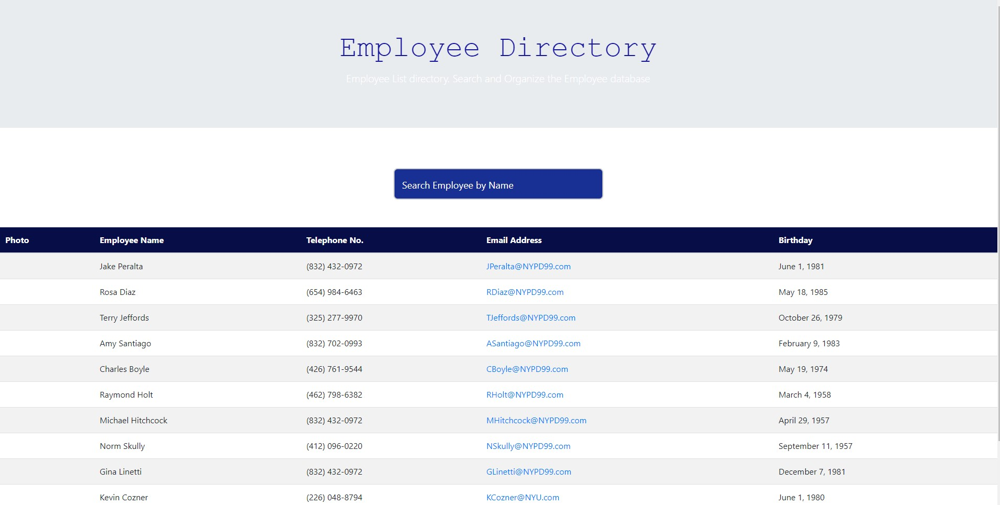
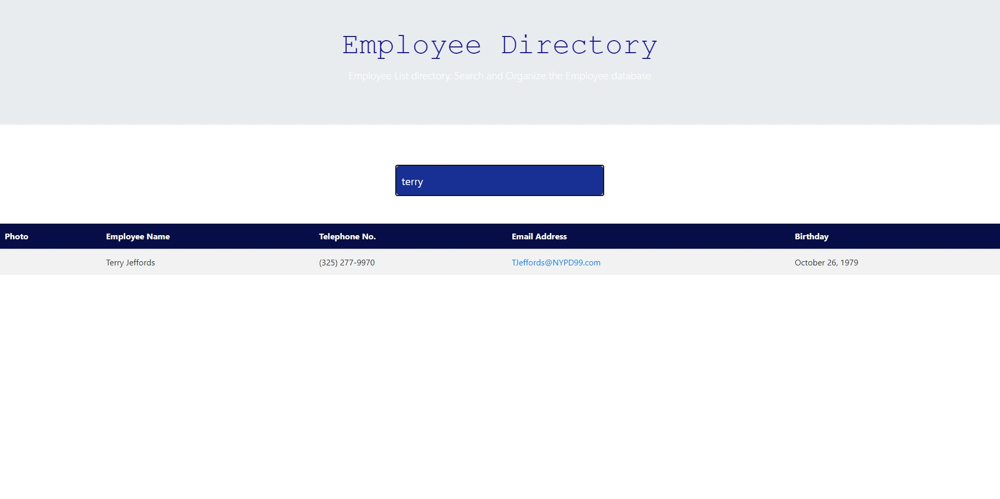

# Employee_Directory

## Description
This Web app was created with React to be an employee directory. This directory allows for the user to filter the employees by name, email, phone number, and DOB in ascending and decending order.

## Table of Content

- [Installation](#installation)
- [Usage](#usage)
- [Author](#author)
- [Images](#images)
- [Demo](#demo)
- [Copyright](#copyright)

### Installation

No Installation required

### Usage

Once you visit the webpage you can click the button by each category to order or type in the seach bar to filter employees.

### Live Webapp

Try it out for yourself at [Employee Directory](https://tranquil-reef-24088.herokuapp.com/)

### Licence

This project is licensed under the MIT- License

### Author

Zach Greenberg

### Images

### Demo

#### CopyRight

Copyright 2020 &copy; Zach Greenberg